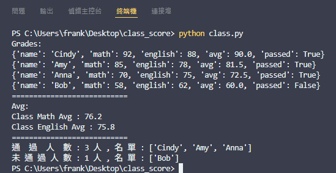
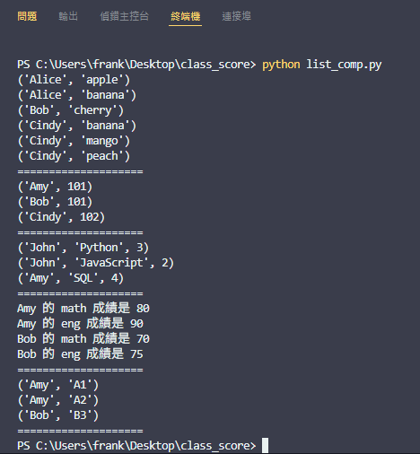

⭐ 班級成績模擬練習

簡介：

基礎語法的練習,包含大量 list、dictionary 以及生成式,藉以提高語法熟悉度、輸出資料類型熟悉度及模組回傳使用及撰寫熟悉度

功能使用說明:

執行即:
輸出班級成績名單、班級各科目平均、通過未通過人數及名單
輸出列表生成式結果

✔️ python 3.12
✔️ 模組化結構

專案結構:

```
class_score
    ├─ class.py (班級成績資料模擬練習)
    ├─ list_comp.py (列表生成式練習)
    ├─ README.md (程式簡介)
    └─ screenshot (畫面截圖 for README)
```

使用方法:

( Git Clone 用網址 https://github.com/Frank-Pon/Class-Score.git ) clone 之後 -> 在終端機輸入 python class.py -> 輸出結果 ✅

心得感想:

最近在大量練習基礎語法,偶爾限制內建函數的使用,強迫自己使用基礎語法來思考

希望能在練習時讓自己沉浸在底層邏輯,更了解程式基本的運作

藉此來提升自己語法的熟悉度、精簡度,也能更清楚每個步驟的資料是什麼型態

這樣練習之後再加上內建函數及函數庫的便捷,相信能大幅改善自己的程式撰寫能力



